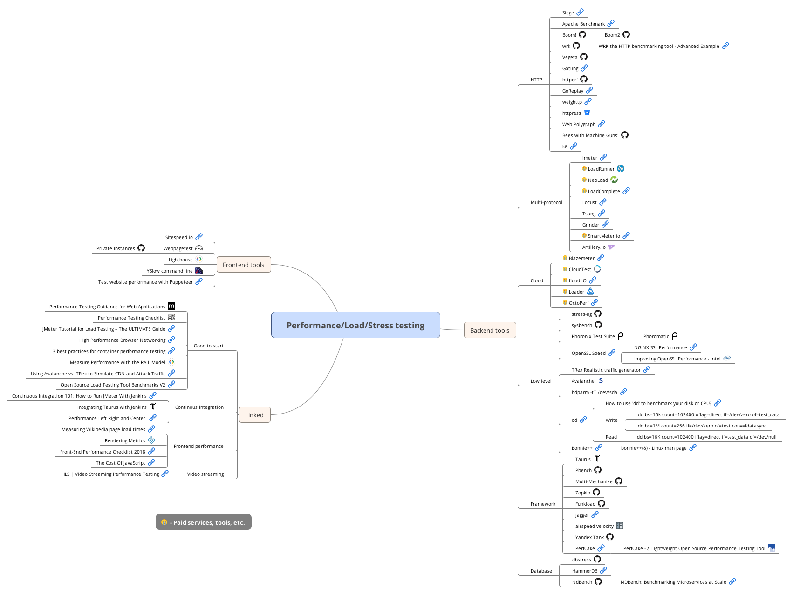

# Quality in mobile apps mindmap

Pull requests welcome

## Mindmap

To edit I use [Xmind](http://www.xmind.net/)

## Legend
:moneybag: - Paid services, tools, etc

## Backend tools

### HTTP

* [Siege](https://www.joedog.org/siege-home/)
* [Apache Benchmark](https://httpd.apache.org/docs/2.4/programs/ab.html)
* [wrk](https://github.com/wg/wrk)
* [Vegeta](https://github.com/tsenart/vegeta)
* [Gatling](https://gatling.io/)
* [httperf](https://github.com/httperf/httperf)
* [GoReplay](https://goreplay.org/)
* [weighttp](https://redmine.lighttpd.net/projects/weighttp/wiki)
* [httpress](https://bitbucket.org/yarosla/httpress/wiki/Home)
* [Web Polygraph](http://www.web-polygraph.org/)

### Multi-protocol

* [Jmeter](http://jmeter.apache.org/)
* [LoadRunner](http://www8.hp.com/pl/pl/software-solutions/loadrunner-load-testing/) :moneybag:
* [NeoLoad](https://www.neotys.com/neoload/overview) :moneybag:
* [LoadComplete](https://smartbear.com/product/loadcomplete/overview/) :moneybag:
* [Locust](http://locust.io/)
* [Tsung](http://tsung.erlang-projects.org/)
* [Grinder](http://grinder.sourceforge.net/)
* [SmartMeter.io](https://www.smartmeter.io/) :moneybag:

### Cloud

* [Blazemeter](https://www.blazemeter.com/) :moneybag:
* [CloudTest](https://www.soasta.com/load-testing/) :moneybag:
* [flood IO](https://flood.io/) :moneybag:
* [Loader](https://loader.io/) :moneybag:
* [OctoPerf](https://octoperf.com/) :moneybag:

### Low level

* [stress-ng](https://github.com/ColinIanKing/stress-ng)
* [sysbench](https://github.com/akopytov/sysbench)
* [Phoronix Test Suite](https://www.phoronix-test-suite.com/)
    * [Phoromatic](https://www.phoronix-test-suite.com/?k=phoromatic)
* [OpenSSL Speed](https://www.openssl.org/docs/manmaster/man1/openssl-speed.html)
    * [NGINX SSL Performance](https://cdn.wp.nginx.com/wp-content/uploads/2014/07/NGINX-SSL-Performance.pdf) 
    * [Improving OpenSSL Performance - Intel](https://software.intel.com/en-us/articles/improving-openssl-performance)
* [TRex Realistic traffic generator](https://trex-tgn.cisco.com/)
* [Avalanche](https://www.spirent.com/Products/Avalanche) :moneybag:

### Framework

* [Taurus](http://gettaurus.org/)
* [Pbench](https://github.com/distributed-system-analysis/pbench)
* [Multi-Mechanize](https://github.com/cgoldberg/multi-mechanize)
* [Zopkio](https://github.com/linkedin/Zopkio)
* [Funkload](https://github.com/nuxeo/FunkLoad)
* [Jagger](https://jagger.griddynamics.net/index.html)

## Frontend tools

* [Sitespeed.io](https://www.sitespeed.io/)
* [Webpagetest](https://www.webpagetest.org/)
    * [Private Instances](https://github.com/WPO-Foundation/webpagetest-docs/blob/master/user/Private%20Instances/README.md)
* [Lighthouse](https://developers.google.com/web/tools/lighthouse/)
* [YSlow command line](http://yslow.org/command-line-har/)
* [Test website performance with Puppeteer](https://michaljanaszek.com/blog/test-website-performance-with-puppeteer)

## Linked

### Good to start

* [Performance Testing Guidance for Web Applications](https://msdn.microsoft.com/pl-pl/library/bb924375.aspx)
* [Performance Testing Checklist](http://www.seleniumtests.com/2016/02/performance-testing-checklist.html)
* [JMeter Tutorial for Load Testing – The ULTIMATE Guide](https://www.javacodegeeks.com/2014/11/jmeter-tutorial-load-testing.html)
* [High Performance Browser Networking](https://hpbn.co/)
* [3 best practices for container performance testing](https://techbeacon.com/3-best-practices-container-performance-testing)
* [Measure Performance with the RAIL Model](https://developers.google.com/web/fundamentals/performance/rail)
* [Using Avalanche vs. TRex to Simulate CDN and Attack Traffic](https://www.incapsula.com/blog/trex-traffic-generator-software.html)

### Continous Integration

* [Continuous Integration 101: How to Run JMeter With Jenkins](https://www.blazemeter.com/blog/continuous-integration-101-how-run-jmeter-jenkins)
* [Integrating Taurus with Jenkins](http://gettaurus.org/kb/Jenkins/)

### Frontend performance

* [Measuring Wikipedia page load times](https://phabricator.wikimedia.org/phame/live/7/post/83/measuring_wikipedia_page_load_times/)